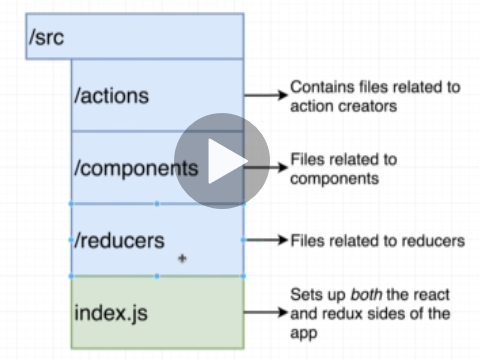

## JSX vs HTML

- JSX === Javascript XML

### Inline Styling in JSX

  기존 HTML 에서는 `style="background-color: blue"` 같이 인라인 스타일링을 했지만, JSX 에서는 몇단계 변화를 거쳐야만 제대로 스타일링이 가능하다. 

  1. 스타일 속성을 감싸고 있는 큰따옴표 대신, 자바스크립트 문법을 쓰겠다는 의미로 `{ }` 중괄호를 쓴다.
  1. 중괄호 안에 또다시 중괄호를 넣어 자바스크립트 객체 안에 css 스타일링 key-value 를 작성할 것임을 알린다.
  1. key 를 기존 `-` 하이픈을 지우고, CamelCase 로 재작성한다.
  1. value 를 작은 따옴표로 감싼다. (작은 따옴표를 쓸지, 큰 따옴표를 쓸지는 팀 의견을 따른다.)

  변환 결과는 다음과 같다.

  `style={{ backgroundColor: 'blue' }}`

  JSX 내에서 자바스크립트 객체를 사용할 수 있기 때문에, 원한다면 JSX 밖에 따로 스타일링에 관련된 객체를 변수에 저장한 후, 위 style 속성 안에서 reference 해도 된다.

  ```javascript
  const style = { backgroundColor: 'blue', color: 'white' };
  // jsx
  return (
    <button style={style}>BUTTON</button>
  );
  ```

### className

자바스크립트 문법의 `class` 키워드와 충돌하는 것을 막기 위해 `className` 을 쓴다. 하지만 이제 리액트가 발전해서 굳이 `className` 으로 변환하지 않아도 된다는 말이 나오고 있다.

### JSX easily reference JS variable 

inline styling 을 할 때 중괄호를 사용해서 자바스크립트를 사용할 것임을 알렸듯이, JSX 내에서 중괄호를 쓰면 자바스크립트 문법을 작성할 수 있다. (변수, 함수실행 결과물 등등)


## React Componenet Tenets (컴포넌트 교리)

1. **Component Nesting**: A component can be shown inside of another
1. **Component Reusability**: We want to make componentse that can be easily reused through out application
1. **Component Configuration**: We should be able to configure a component when it is created

## Rules of Class Components

1. Must be a Javascript Class
1. Must extend (subclass) React.Component
1. Must define a `render` method that returns some amount of JSX

## Rules of State

1. Only usable with class components
1. You will confuse props with state :(
1. 'state' is a JS object that contains data relevant to a component
1. Updating 'state' on a component causes the component to (almost) instantly rerender
1. State must be initialized when a component is created
1. State can only be updated using the function `setState`

### Default Props
functional Component 의 경우, 컴포넌트 함수 밖에 `defaultProps` 를 따로 선언해줌으로써 props 의 기본값을 설정할 수 있다.

```javascript
Spinner.defaultProps = {
  message: 'Loading...'
}
```

### Helper Method
`render()` 메서드에 조건 분기가 많아지는 것은 나쁘다. 따라서 만약 조건분기에 따라 다른 화면을 그려줘야 하는 상황이라면, 따로 helper method 를 만들어서, 그곳에서 조건분기를 처리하고, 결과값만을 return 받아 `render` 메서드 내에서 사용하는 것이 맞다.


## Redux

### Redux Cycle

1. Action Creator : `Action` 이라고 부를 Javascript Object 를 반환한다.
2. Action : `type`, 와 `payload` property 를 가진 자바스크립트 객체다. `type` 키의 값은 대문자와 언더스코어만을 쓰는 것이 convention 이다.
3. dispatch : `Action` 을 받아서, 복사한 후, `Reducer` 들에게  뿌린다.
4. Reducers :  현재 state 상태를 가지고와서, `Action` 에 따라 변형한 후, 다시 state 를 되돌려주어 업데이트한다.  이때 돌려주는 state 는 반드시 **새로 만들어진** 것이어야 한다. 즉, 기존의 state 를 변형하는 게 아니라 복사해서 업데이트 된 새로운 것으로 만들어 되돌려 주어야 한다.(물론 `type` 이 아예 자신과 상관없는 것일 경우, `if` 문에서 걸러지지 않았을 테고, 그럼 맨 마지막에 그냥 가져왔던 state 를 그대로 반환하며, 이때는 굳이 새로 만들지 않는다.)   또, 처음에 `undefined` 상태로 state 가 존재할 수 있기 때문에, 매개변수로 받을 현재 상태 state 에 **default value** 를 주어야 한다..
5. State

### Redux Store

위의 Redux Cycle 각각을 구현하는 데는 `Redux` 가 전혀 필요하지 않은 단순 자바스크립트 코드다. 리덕스가 필요한 시점은, 그렇게 용도에 따라 만든 `Reducers` 를 모아서 **하나의 `Store` 를 만드는 데**있다. 즉, 리덕스 객체에서 `createStore`, `combineReducers` 라는 메서드를 가져와서, 만들어놨던 `Reducer` 들을 합쳐 `Store` 를 만든다. 이렇게 `Store`를 만들면, 리덕스가 제공하는 `Dispatch`나, `getState` 등을 사용할 수 있다. 


```javascript
const {createStore, combineReducers} = Redux;

// 기존에 만들어놨던 Reducer 들을 합친다.
const outDepartments = combineReducers({
    accounting,
    claimsHistory,
    policies
})

// 합친 Reducer 모음으로 하나의 Store 를 만든다. 중앙 저장소처럼 생각하자.
const store = createStore(ourDepartments)

// 사용 예
// createPolicy 라는 미리 정의해놨던 Action Creator 로, Action 을 하나 만든다.
const action = createPolicy('Joshua', 27)
// 리덕스가 제공하는 dispatch 를 사용해 dispatch 하자.
store.dispatch(action) // store.dispatch(createPolicy('Joshua', 27)) 처럼 줄여서 사용해도 된다.
// 업데이트 된 store 상태를 확인할 수 있다.
console.log(store.getState())
```


### React-Redux

Redux 는 React만을 위해서 만들어진 것이 아니기 때문에, `React-Redux` 라는 라이브러리를 따로 설치해서 사용해주어야 한다. 

1. React 앱의 최상단 컴포넌트였던 `App.js` 보다도 더 높은 곳에 `Provider` 라는 최최상단 컴포넌트를 둔다.
2. `Provider` 컴포넌트의 `prop` 으로 리덕스 `Store`를 넘겨준다. 즉, `Provider` 컴포넌트만이 내부적으로 `Store` 에 접근 권한을 가지고 있다.
3. 이제 `Store` 에 접근해서 데이터를 가져오고 싶은 컴포넌트가 있다면 그 컴포넌트를 `Connect` 라는 컴포넌트로 감싸준다. 이 `Connect` 라는 컴포넌트는 내부적인 로직을 통해 `Provider` 와 직접적인 소통이 가능하다. 즉, 컴포넌트 계층 구조와 상관없이 `Provider` 컴포넌트와 소통할 수 있다.  이 과정에서 컴포넌트를 감싸는 `Connect` 컴포넌트는 내가 직접적으로 만드는 게 아니라 `React-Redux` 라이브러리가 제공해준다.
4. 이제 `Action Creators` 로 생성된 `Action` 을 `Connect` 컴포넌트가 `Provider` 에게 전달해서 데이터를 받아온 후, 그 데이터가 필요한 자식 컴포넌트에 `Props` 로 넘겨주어, 그 컴포넌트 내부에서 데이터를 사용할 수 있게 한다. 


### Redux project Structure




## Async Actions with Redux Thunk

비동기적으로 데이터를 가져올 때, 컴포넌트의 `componentDidMount` 생명주기에서 `Action creator` 를 호출해 데이터를 가져온다. 그런데 `Action creator` 가 반환하는 `Action` 의 `payload` 속성에, Async-await 관련 코드가 들어가면 에러가 발생한다. `Action` 은 plain javascript object 를 반환해야 하는데 그러지 못하고 있기 때문이다. (async 함수는 보이는 것보다 내부적으로 훨씬 더 복잡하기에 겉보기와 달리 plain 자바스크립트 객체를 반환하는 게 아니다.) 그렇다고 단순히 Promise 객체를 `payload` 로 넣어준다고 리덕스가 알아서 그걸 기다렸다가 다시 싸이클을 돌려주지 않는다. 

그래서 `Redux Thunk` 같은 미들웨어를 이용해야 한다. 

### 미들웨어

리덕스에서 미들웨어란, `Action` 이 dispatch 될 때마다 호출되는 함수다. 이 함수는 `Action` 을 **멈추**거나 **수정**하는 등 `Action` 을 갖고 놀 수 있다. 오픈소스 미들웨어의 종류는 다양한데, 가장 유명한 미들웨어는 비동기 `Action` 을 처리하기 위한 것들이며, 그 중 `Redux Thunk` 를 배울 것이다. (물론 비동기 외에도 다른 용도에도 충분히 활용 가능한 미들웨어다.)

### Redux Thunk 의 Rules

본래 **Rules of Actions** 은

1. Action Creators must return action objects
2. Actions must have a type property
3. Actions can optionally have a 'payload'

였다. 

그런데 Redux Thunk 는 이 룰을 수정한다. 즉, 

1. Action creators **can** return action objects
2. Action creators **can** return **Functions**
3. If an action object gets returned, it must have a type property
4. If an action object gets returned , it can optionally have a 'payload'

즉, 이제 **함수** 를 반환하는 `Action Creator` 가 있다. Redux Thunk 는 원래처럼 객체를 반환하는 Action Creator 는 상관하지 않고, **함수를 반환하는 경우에만** 특별한 처리를 도와준다.

### 비동기 함수와 Redux Thunk

어떤 Action Creator 가 비동기 요청을 처리하는 함수를 반환하는 경우,  redux thunk 는 그 함수가 `dispatch` 와 `getState` 에 접근할 수 있는 권한과 함께(인자로 받아서 가지고 간다.) 호출되게 한다. 그리고, 비동기 처리가 끝난 후에 비동기 결과 데이터를 담은 `Action` 을 담아 다시 `dispatch` 한다.

>  Redux Thunk 의 깃헙 코드를 찾아가보면 고작 **14줄** 짜리 놀라운 코드를 볼 수 있다.  


아래는 사용 예시다. 

```javascript
export const fetchPosts = async () => {
  // 비동기 실패 Bad approach. ERROR: Actions must be plain objects!
  // const response = await jsonPlaceholder.get('/posts');

  // return {
  //   type: 'FETCH_POSTS',
  //   payload: response,
  // };

  // Redux Thunk 로 함수를 반환하면 비동기 처리가 이용가능하다.
  return async function (dispatch, getState) {
    const response = await jsonPlaceholder.get('/posts');
    
    dispatch({type: 'FETCH_POSTS', paylaod: response})
  }
};

// 위 Action Creator 를 화살표 함수로 간략화하면 아래와 같다.
export const fetchPosts = () => async dispatch => {
    const response = await jsonPlaceholder.get('/posts');
    dispatch({type: 'FETCH_POSTS', payload: response})
}
```


## Redux Store Design

### Rules of Reducers

1. Must return any value besides 'undefined'. 즉 `action` 의 type 속성이 일치하는 게 없다면 현재 값, 현재 값도 없다면 매개변수로 받을 때 default state value 로 `null` 이든 `[]` 같은 빈 리스트든 빈 객체든 뭐든 넣어놨다가 반환해야 한다.
2. Produces 'state', or data to be used inside of your app using only previous state and the action (reducers are pure). (위 1번 rule 과 거의 같은 내용. 맨 처음 앱이 실행될 때 기본 설정값이 바로 설정되기에 곧 previous state 가 된다.)
3. Must not return reach 'out of itself' to decide what value to return (reducers are pure). Reducers 는 오직 이전 state 와 Action 만으로 변하기 때문에 외부 api 요청이나 DOM 에 접근해서 값을 받아오는 등의 행위가 reducers 내에서 일어나면 안 된다는 것을 뜻한다. 
4. Must not mutate its input 'state' argument
   1.  이 마지막 룰이 오해가 많다. 사실 redux 코드를 뜯어보면, reducer 가 반환한 state 가 이전 state 와 같은지 다른지를 `!==` 로 비교하고 있다. 그래서 비교해보고 변화가 있으면 변화를 업데이트하고 아니면 넘어간다. 그런데 알다시피 reducer 는 `Action` type 가 일치하는 게 없으면 이전 state 를 그대로 반환한다. 즉, reducer 내부에서 인자로 받은 state 를 어떻게 `mutate` 하든간에, **새로운** state 로 다시 복사해서 반환하지 않으면 메모리 상에서 가리키는 주소는 똑같다. (`!==` 비교 오퍼레이터는 어차피 메모리 주소만 비교한다.) 그래서 변화시키든 말든 사실 상관없다. 뭘 반환하는지가 중요하지.. 즉, 너무 겁먹고 **인자로 받은 state 의 어떤 것도 변화시키지 않으려고 할 필요가 없다**. **물론!** 절대 권장되지 않으므로, 걍 맘편하려면 변화시키면 안된다고 기억하는 게 좋다. 


### API call action 최적화

어떤 정보를 받아올 때, 똑같은 정보를 얻기위해 복수의 api 호출을 하는 상황이 종종 발생한다. 예를 들어 어떤 유저 정보가 페이지 내에서 여러번 필요할 때, 그때마다 그 유저 정보를 다 받아오면 자원 낭비가 심하다. 그래서, 앱 내에서 정보를 일종의 캐싱해놓고 쓸 필요가 있다. Redux 를 사용할 때는, 데이터를 가져오기 위한 `Action` 을 생성하는 Action Creator 를 변경해서 최적화를 노린다. 

1. lodash 를 이용한 최적화
   1. 기존 Action Creator 를 Action Creator 외부의 함수를 호출하는 형태로 변형해서 그 외부 함수에 어떤 인자에 대한 결과값을 저장해놓는 방법이다. **lodash** 의  `_.memoize()` 를 사용한다.
   2. 그러나 이 방법을 사용하면, 한 번 사용된 인자면 무조건 같은 값만을 반환하기 때문에, 업데이트 되었거나 이런 걸 받아볼 수 없고, 코드도 얼핏보면 이해하기 어렵다.

```javascript
export const fetchUser = (id) => (dispatch) => {
  _fetchUser(id, dispatch);
};

const _fetchUser = _.memoize(async (id, dispatch) => {
  const response = await jsonPlaceholder.get(`/users/${id}`);
  dispatch({ type: 'FETCH_USER', payload: response.data });
});
```


2. lodash 보다 훨씬 범용적으로, 또 유연하게 많이 쓰이는 방법
   1. 기존 `fetchUser` 나 `fetchPosts` 같은 Action Creator 를 변형하지 않고, 각각의 Action Creator 를 내부에서 호출하는 큰 함수를 만든다.
   2. 즉, 상황에 맞게 어떤 순서와 방법으로 두가지 이상의 Action Creator 를 효과적으로 **합칠지** 고민한다. 

```javascript
export const fetchPostsAndUsers = () => async (dispatch, getState) => {
  console.log('About to fetch posts');
  await dispatch(fetchPosts());
  // const userIds = _.uniq(_.map(getState().posts, 'userId'))
  // ES6 버전
  const uniqueUsers = [...new Set(getState().posts.map((post) => post.userId))];
  uniqueUsers.forEach(id => {
    dispatch(fetchUser(id))
  });
}
```


## React Router

React Router 는 하나의 `path` 에 단 하나의 컴포넌트가 배정되는 것이 **아니다** 라는 것을 잘 인지하고 있어야 한다. 즉, 어떤 **Nested Routes** 같이 상황에 따라 부분만 일치하는 `path` 들도 모두 화면에 그려질 수 있으며, 한 컴포넌트가 다른 데 쓰였다고 해서, 또다른 `path` 에 사용 불가능한 것도 아니다. (이런 걸 피하고 싶다면`exact` 키워드를 쓰거나 하자.)


## Google OAuth

사실 문서가 아주 깔끔하게 정돈되어 있지는 않다. 공식 문서를 타고타고 들어가 잘 확인해봐야 한다..

[공식문서](https://developers.google.com/identity/protocols/oauth2/javascript-implicit-flow)

 [공식Github 문서](https://github.com/google/google-api-javascript-client)

[구글Oauth 로그인관련 Github 공식문서](https://github.com/google/google-api-javascript-client/blob/master/docs/samples.md#authorizing-and-making-authorized-requests)


대충 정리해보자면

1. `index.html` 에서 전역 스크립트를 불러와 전역 스코프에서 `gapi` 를 사용할 수 있게 먼저 세팅한다. 이 시점에서 그 스크립트는 `  <script src="https://apis.google.com/js/api.js"></script>` 이다.
2. `gapi` 는 그냥 다른 구글 api 를 불러오는 시작점일 뿐이고, `load` 메서드를 이용해 앱에서 쓸 다른 api 라이브러리를 끌어와야 한다. 일단 로그인부터 해보자.
3. 구글 로그인이 필요한 컴포넌트에서 `window.gapi.load('client:auth2')` 로 로그인 OAuth 관련 라이브러리를 우선 불러온다. 그런데 이렇게 불러오는 과정에서 시간이 걸리기 때문에, 두번째 인자로 콜백함수를 넣어줘야 한다. 즉, `window.gapi.load('client:auth2', () => {})` 와 같이 콜백함수를 2번째 인자로 넣을 것이며, 이 콜백 함수는 사용할 구글 라이브러리 및 인증 정보를 더 세부적으로 담게 된다.


## React-Router

> With React-Router, each component needs to be designed to work in isolation (fetch its own data!)

위 말은, 각 Route의 컴포넌트에서 사용할 데이터는 다른 컴포넌트에서 불러오는 데이터에 의존해서는 안된다는 것이다. 즉, 다른 컴포넌트의 `componentDidMount` 같은 라이프 싸이클에서 불러오는 데이터는 그 컴포넌트가 로드되기 전에는 Redux 에 업데이트되지 않는다. 그래서 그 데이터의 일부를 사용하려면 그 컴포넌트를 먼저 방문해야만 한다.. 즉 직접적으로 부분 데이터만 쓰는 Route 에 새로고침이나 주소창에 쳐서 접근하면 참조할 데이터가 없으므로 `undefined` 가 되는 것이다. 즉 모든 Route 컴포넌트는 자기자신의 data 를 따로 불러와야 한다. (fetch its own data)

