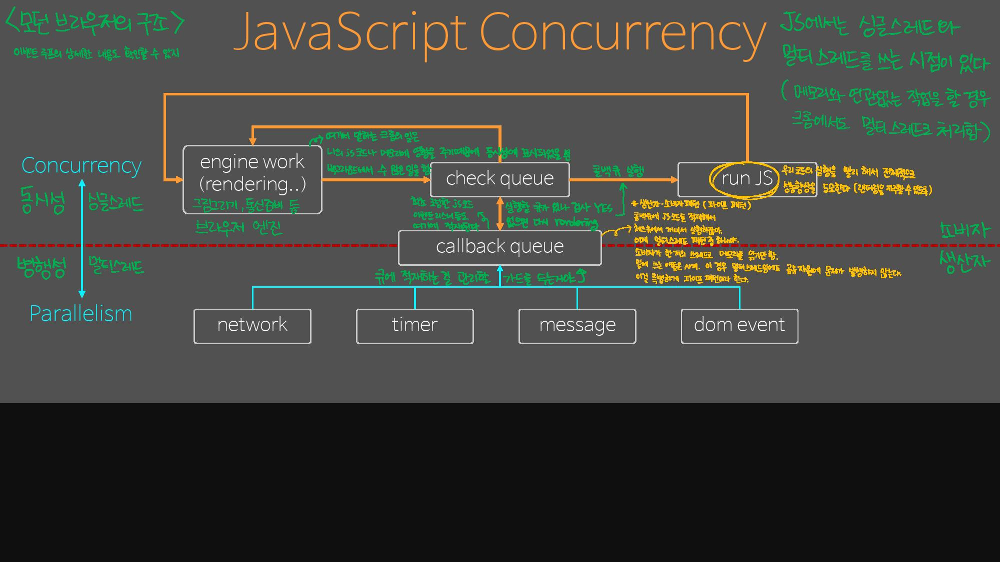

## 자바스크립트 엔진 구조

자바스크립트 엔진은 메모리 힙과 단일 호출 스택 (Call Stack)을 가지고 있다. 자바스크립트 엔진은 콜 스택에 스택의 형태로 호출된 함수를 추가하고 (Push) 실행된 함수를 제거 (Pop) 하는 형태이다. 이렇게 자바스크립트는 다른 함수가 실행되고 있을때는 그 함수가 종료되기 직전까지 다른 작업이 중간에 끼어들 수 없다. 이것을 Run-to-completion 이라고 한다. “뭐야, 그럼 결국 동시실행이 불가능하다는 이야기잖아.” 하고 실망할 수 있겠지만,  자바스크립트는 자바스크립트 엔진으로만 돌아가는 것이 아니다. 자바스크립트 엔진 밖에서도 자바스크립트 실행에 관여하는 요소들이 존재한다. 각각 Web API와 Task Queue, Event Loop 이다.  비동기 작업시 각 요소의 역할에 대해 알아보자.

> 요약: 자바스크립트는 싱글 스레드이지만 이벤트 루프, Web APIs(노드의 경우 C++ APIs), Callback Queue가 존재하기 때문에 비동기 콜백 작업이 가능하다. _출처: https://prohannah.tistory.com/59 [Hello, Hannah!]

### Web API

Web API 는 브라우저에서 제공되는 API이며, AJAX나 Timeout 등의 비동기 작업을 실행한다. 자바스크립트에서 setTimeout 과 같은 함수를 실행하면, 자바스크립트 엔진은 Web API에 setTimeout 을 요청하고 동시에 setTimeout에 넣어준 **Callback 까지** 전달한다. *Callstack 에서는 Web API 요청 이후 setTimeout 작업이 완료되어 제거된다.* 자바스크립트가 호출 스택이 하나인 싱글 스레드임에도 여러 가지 일을 동시에 처리하는 것처럼 동작할 수 있는 이유이다. 이를 동시성(Concurrency)라고 표현한다.

출처: https://prohannah.tistory.com/59 [Hello, Hannah!]

Web API는 요청받은 setTimeout을 완료하고, 동시에 전달받았던 Callback 을 Task Queue라는 곳에 넘겨준다. 

### Task Queue(Callback Queue) & Event Loop

**Task Queue 는 Callback Queue** 라고도 하는데, 큐 형태로 Web API에서 넘겨받은 Callback 함수를 저장한다. 이 Callback 함수들은 자바스크립트 엔진의 **Call Stack의 모든 작업이 완료되면 순서대로 Call Stack에 추가**된다. 이 때 Call Stack 가 비어있지 않은지 (실행중인 작업이 존재하는지) 와 Task Queue 에 Task가 존재하는지 를 판단하고, Task Queue 의 작업을 Call Stack 에 옮기는 일을 Event Loop가 작업한다. Event Loop 는 이 작업을 처음부터 끝까지 계속 반복하여 실행한다. 그래서 Event ‘Loop’ 인것이다. 

call stack이 비어있지 않은 동안에는 task queue로부터 전달되는 콜백함수의 실행이 지연되므로, **setTimeout 함수에 넣어준 인터벌은 정확하지 않다.**

MDN은 Event Loop의 작업을 아래와 같은 가상의 코드로 설명하고 있다.
```javascript
while (queue.waitForMessage()) {
    queue.processNextMessage();
}
```

Javascript 엔진은 그저 주어진 코드를 실행하는 **온디맨드 (on demand) 실행 환경**이라는 것이다. 그 **코드 실행의 스케줄링은 Javascript 엔진이 호스팅된 런타임 환경**이 맡게되는 것이다.

## Modern Browser Workflow



1. Engine work (브라우저 엔진의 작업)
    먼저, 브라우저 엔진은 렌더링, 통신 준비, 메모리 초기화, 프로세스 정리 등과 같은 수많은 작업을 백그라운드에서 멀티 스레드(Multi thread)로 처리한다.

1. 싱글 스레드(Single thread)로 처리될 때에는, 내가 작성한 js코드나 메모리에 영향을 끼치는 작업을 수행할 때이다. 이러한 작업은 엔진이 하는 일 중에서 극히 일부분이지만, 나의 코드에 따른 엔진의 일을 표시하기 위해 싱글 스레드, 동시성 안에 표시해두었다.

- Check Queue
실행해야할 Callback queue가 존재하는지 검사한다. 큐가 존재한다면 명령어를 꺼내 ④ Run, 존재하지 않다면 다시 ① Engin work 단계로 돌아간다.

- Callback Queue
Web API 스레드는 각자 해야할 일을 수행 후, Callback Queue에 콜백 함수를 적재시킨다. 이때 Web API는 멀티 스레드로, 각 작업을 병행적으로 처리한다.

때문에 Callback Queue를 기준으로 싱글 스레드와 멀티 스레드 작업으로 나눌 수 있다.

즉, Callback Queue 상단은 싱글 스레드로 작업을 Concurrent하게 처리하고, 하단은 멀티 스레드로 작업을 병행적으로 처리한다.

출처: https://prohannah.tistory.com/59 [Hello, Hannah!]