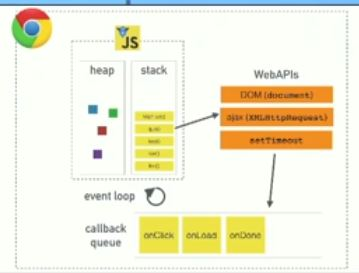

[youtube_What the heck is the event loop anyway?](https://youtu.be/8aGhZQkoFbQ)

# 자바스크립트란?

적당히 찾아보면 알 수 있는 간단한 설명은 다음과 같다.

> A single-threaded non-blocking asynchronous concurrent language

또 추가적으로 공부한다면

> Call stack, event loop, callback queue(task queue), some other apis

등을 가지고 있음을 알 수 있다. 

그런데 또 `자바스크립트 런타임` 이라는 **V8** 은 그저 `call stack` 과 `heap` 두 개만 가지고 있다고 한다...

> **Javascript runtime** refers to where your javascript code is executed when you run it. That said, javascript can be executed on google chrome, in which case your javascript runtime is v8, if on mozilla - it is spidermonkey, if IE - then its chakra and if on node, again its v8.

## JS 동작 환경

런타임 내에는 메모리 관리를 위한 heap 과 callstack 만이 있을뿐, `DOM`, `AJAX`, `setTimeout`과 같은 기능은 **Web APIs** 가 담당하며, **callback queue** 와 `**event loop** 가 다른 기능을 담당한다.

# the call stack

자바스크립트는 싱글 스레드 언어이며, 따라서 싱글 스레드 런타임을 가지며, 따라서 싱글 콜 스택을 가진다.

콜스택은 **지금 어디에 있는지** 를 알려준다고 봐도 된다. 함수가 호출될 때마다 쌓이고, 함수가 반환할 때마다 pop 된다. 맨 처음에는 파일 그 자체인 `main` 함수가 콜스택에 쌓인다는 걸 알고 있자. 'anonymous function' 으로 실제로 쌓인다. (에러를 발생시켜보면 확인할 수 있다.)

# callback queue and event loop

자바스크립트는 싱글 스레드이고, 한 번에 하나만 하는 게 맞지만, `asynchronous` 를 활용해 마치 concurrently 하게 여러 작업을 하는 척 할 수 있다. 

**브라우저는 런타임만으로 동작하는 게 아니기 때문이다.**

예를 들어 `setTimeout` 도 브라우저가 제공하는 web apis 중 하나로,(노드 환경이면 C++ 라이브러리가 대신한다.) 브라우저가 대신해서 timer 를 실행시킨 후에 타이머가 다 지나면 **task queue(callback queue)** 에 콜백을 넘겨준다. 그러면 열심히 `stack` 과 `task queue` 를 체크하며 돌고 있던 **event loop** 가 **`stack` 이 *비어있으면* `task queue`의 첫 요소를 `stack` 으로 옮겨준다.** 즉, 
1. 콜스택이 아직 비어있지 않거나, 
2. task queue 가 너무 꽉차 있다면 

하나씩 call stack 으로 옮겨서 실행하는 과정에서 시간이 정확하지 않을 확률이 높아진다.

# Render queue
왜 비동기를 쓰는 것이 유저 경험에도 좋은지 자세히 알아보자.

브라우저가 유저가 보는 화면을 그리는 렌더링도 큐가 존재한다. 이 렌더 큐는 브라우저가 알아서 끊임없이 화면을 그리도록 동작하지만, 얘도 자바스크립트 콜스택이 비어 있어야만 매번 화면을 다시 그릴 수 있다. 그런데 비동기를 사용하지 않으면 코드에 따라 콜 스택이 너무 오랫동안 차 있을 수 있고, 그럼 화면을 그릴 수가 없게 된다. 

반면 비동기는 call stack 을 차지하고 있지 않고 callback queue 에서 기다리다가 이벤트루프가 한개씩 가져가서 처리하다보니, 그 사이사이에 렌더 큐가 동작할 공간을 내주게 된다.