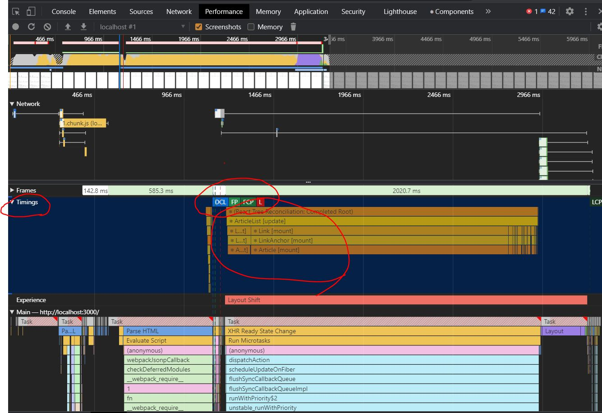

# 핵심
1. 로딩 성능 : 리소스를 가져오는 속도
2. 렌더링 성능 : 가져온 리소스로 유저가 보는 화면을 그리는 속도

위 두 개의 성능을 최적화 해야 한다.

## 실습내용

1. 로딩 성능 최적화
    - 이미지 사이즈 최적화
    - Code Split
    - 텍스트 압축
2. 렌더링 성능 최적화
    - Bottleneck 코드 최적화

# Lecture-1

## Lighthouse (이전 크롬버전에서는 audit)
개발자도구의 **lighthouse** 를 돌려보면 종합 보고서를 받아볼 수 있다.

`Opportunities` 는 주로 로딩 성능에 대한 개선 가능성을, `Diagnostics` 는 주로 렌더링 성능에 대한 개선 가능성을 말해준다. 회색으로 표시된 항목들은 문제가 되는 것까진 아니지만 한 번 살펴볼만 하다는 의견이다. 

`passed audits` 는 잘 했다는 항목이니 넘어가도 된다.

`Runtime settings` 는 검사할 때 사용한 환경을 보여준다.

### 이미지 사이즈 최적화

화면에 표시되는 이미지 크기의 약 2배 정도의 너비만 가져도 충분하기 때문에, 원본 이미지의 사이즈를 줄여서 가져올 필요가 있다.

하지만 자체 서버에서 가져오는 이미지가 아니라면 Image CDN 을 통해 이미지를 가공한 후 가져와야 할 것이다. 

> CDN (Contents Delivery Network) : 물리적 거리의 한계를 극복하기 위해 소비자(사용자) 와 가까운 곳에 컨텐츠 서버를 두는 기술

일반 CDN 과 달리 Image CDN 은 사용자에게 이미지를 보내기 전에 사이즈를 바꾸거나 이미지 포맷을 바꾸는 등의 처리를 할 수 있다. 

예시) `http://cdn.image.com?src=[img src]&width=200&height=100`

위 예시처럼 Image CDN 서버에 원본 이미지 소스 이외에 원하는 사이즈 옵션을 달아서 요청하면 원하는 이미지를 얻을 수 있다.

Image CDN 을 자체구축하거나 `imgix` 같은 서비스를 이용하자. 혹은 `splash` 같은 이미지 제공 사이트에서 이미지를 가져온다면 자체 제공하는 이미지 전처리 기능이 있다.

### Minify JavaScript

이 항목은 production 으로 빌드하면 알아서 해주니 신경 안 써도 된다.

## Javascript 코드 최적화를 위한 Performance 탭

lighthouse 에서도 자바스크립트 코드와 관련해서 최적화가 필요하다고 알려주지만, 정확히 어떤 코드가 문제인지 파악하려면 Performace 탭에서 검사를 다시 해보자.

1. 어떤 작업이 얼마나 시간이 걸렸는지 확인할 수 있다. 
2. 어느 시점에 처음으로 화면이 그려졌는지 표시해준다.
3. React 앱의 경우 `Timing` 이란 작은 탭에서는 어떤 컴포넌트가 로드됐는지까지 확인 가능하다!



강의에서 제공한 lecture1 프로젝트의 경우, `Article` 컴포넌트의 `removeSpecialCharacter` 라는 항목이 엄청난 시간을 잡아 먹는 것을 확인할 수 있다. Performance 탭에서는 `removeSpecialCharacter` 가 좀 끊겨서 나타나지만, 사실 여러번 진행된 것은 아니고, 너무 많은 메모리를 차지해서 중간중간에 `Minor GC` 라고 적혀있는 가비지 컬렉터가 분할해서 실행하고 있었음을 확인할 수 있다.

그래서 해당 컴포넌트에 들어가서 코드를 최적화 해주면 훨씬 성능 향상이 있따는 것을 확인할 수 있다.

## Webpack bundle analyzer

웹팩 번들링의 결과인 `chunk~.js` 파일에서 어떤 코드가 어느정도의 크기를 차지하는지 시각화해서 보여주는 bundle analyzer 을 사용해보자. 아쉽게도 CRA(Create React App) 으로 생성한 프로젝트는 직접적으로 웹팩을 세팅할 수 없게 되어있다. eject 같은 걸 해야 하는데, 다행히 `cra-bundle-analyzer` 라는 CRA 프로젝트를 위한 라이브러리가 있으니 다운해서 사용하도록 하자. 라이브러리를 다운 받은 후 `npx cra-bundle-analyzer` 명령어로 `report.html` 파일을 만들어낼 수 있다.

결과를 보면 `node_modules` 내의 코드 중에서도 `refractor` 라는 라이브러리가 큰 공간을 차지하는 걸 알 수 있다. 그런데 이 라이브러리는 마크다운의 syntax highlight 을 위한 것이므로, 메인 페이지에서 불러올 이유가 없다. 따라서 메인 페이지 로딩 속도 개선을 위해서, 따로 **Code splitting & Lazy Loading** 해줄 필요가 있다.

### Code splitting & Lazy Loading

하나의 bundle.js 파일을 페이지마다의 chunk 파일로 나누어서 필요한 것만 우선 로딩하도록 분할할 수 있다.

> 중요한 것: 불필요한 코드 또는 중복되는 코드 없이 적절한 사이즈의 코드가 적절한 타이밍에 로드될 수 있도록 하는 것

리액트의 경우 리액트 자체 기능 중 하나인 `Suspense` 와 `lazy` 를 활용할 수 있다. `Suspense` 는 동적 로딩을 하느라 아예 아무것도 없는 상황일 때를 대비해 default 페이지를 띄워주는 역할을 한다.

```js
// Code Splitting 예시 코드
const ListPage = lazy(()=> import('./pages/ListPage/index'))
const ViewPage = lazy(() => import('./pages/ViewPage/index'));
```

### 텍스트 압축 적용

2kb 이상의 텍스트는 gzip 으로 압축해주는 게 성능상 도움된다.

> gzip 은 deflate 라는 압축 알고리즘(LZ77, 허프먼 코드? 등을 사용한 인기있는 압축 알고리즘)에 추가적인 기법(블럭화, 휴리스틱 필터링, 헤드와 체크섬 등)을 더한 것으로, 성능이 우수해 웹 환경에서 자주 쓰인다.

파일을 압축해서 서빙하는 것은 서버의 역할이므로, 서버에서 텍스트 압축을 하는지 체크해야 한다. 서버를 여러개 운영한다면, 그 서버들이 모이는 곳인 라우터 서버 같은 곳에서 처리하는 것도 좋다.


# Lecture 2 (통계 사이트)

## 브라우저 렌더링 과정

1. HTML, CSS, JS 파일 같은 정적 파일들을 가져와서 `DOM` 트리와 `CSS Object Model` 으로 변환시킨다. 

2. 위의 변환된 내용을 Render Tree 로 만든다. Render Tree 는 두 개를 조합한 것으로 보면 된다.

3. 브라우저가 Layout 으로 만든다. **위치와 크기를 계산한다.**

4. Paint 한다. 레이아웃 위에 색을 칠하면서 그려나간다. 

5. Composite 한다. Composite 는 각 layer 를 합치는 과정이다. 합쳐서 최종 화면을 만든다. 

위 전체적인 과정을 Critical Rendering Path Pixel Pipeline 이라고 한다. 

## Reflow

`width`, `height` 같은 layout 속성을 변경하는 경우에는, 화면 전체를 다시 계산해야 하므로 위 다섯 과정을 처음부터 다시 하게 된다. 즉, 완전히 새로 모든 것을 하는 걸 Reflow 라고 한다.

## Repaint

`color`, `background-color` 같이 색이 변경될 뿐 크기나 위치가 변하지 않으면 **Layout 단계를 생략** 할 수 있다. 이렇게 Layout 과정을 건너띄게 되는 상황을 **Repaint** 라고 한다. 

## GPU 도움을 받아 Reflow 와 Repaint 피하기

`transform`, `opacity` 같은 속성은 Render Tree 를 그리는 2단계까지는 동일하지만 , Layout, Paint 두 단계를 GPU 가 대신해서 처리해서 layer 를 만들어서 Composite 단계로 넘겨준다. 즉, 가장 빠르다.

## 컴포넌트 Preloading

Lazy loading 처리를 하면 첫 로딩 시간과 크기는 줄일 수 있지만, 결국 나눠진 파일이 필요해졌을 때 다시 그걸 불러오고 해석할 시간이 필요하다. 

그래서 Preloading 기능으로, 미리 로딩하도록 할 수 있다. 마우스 오버이벤트 같은 이벤트에 기능을 달 수도 있고, 최초 페이지 마운트가 끝났을 때 추가적으로 진행할 수도 있다. 

```js
// 마우스 엔터 이벤트에 걸었을 때 이벤트 처리.
// 딱히 변수를 딴 데서 사용하지 않아도 된다. 
const handleMouseEnter = () => {
    const component = import('./components/ImageModal')
}
```

```js
// 마운트 후 추가로 프리로딩 할 때.
useEffect(() => {
  const component = import('./components/ImageModal');
}, []);
```

```js
// 팩토리 패턴을 사용해 preload 기능을 탑재한 컴포넌트를 만들어 활용할 수도 있다.
function lazyWithPreload(importFunction) {
    const Component = lazy(importFunction)
    Component.preload = importFunction
    return Component
}

const LazyImageModal = lazyWithPreload(() => import('./components/ImageModal'));

//...
  useEffect(() => {
    LazyImageModal.preload()
  }, []);
```

## 이미지 프리로딩

모달을 프리로딩 해와도, 모달 안의 이미지는 또 따로 프리로딩 해야 한다. 이미지는 기본적으로 화면에 노출되었을 때 그려지기 시작하기 때문이다.

이미지 객체를 미리 생성한 후, 그 안에 `.src` 주소를 넣는 순간 이미지가 가져와진다는 점을 활용할 수 있다. 

```js
  useEffect(() => {
    LazyImageModal.preload();

    const img = new Image()
    img.src =
      'https://stillmed.olympic.org/media/Photos/2016/08/20/part-1/20-08-2016-Football-Men-01.jpg?interpolation=lanczos-none&resize=*:800'; // 이 시점에 이미지가 네트워크로 가져와지고, 캐싱되어 모달을 띄웠을 때 빠르게 뜨게 된다. 중요한 첫 이미지만 프리로딩하도록 하자.
  }, []);
  ```

